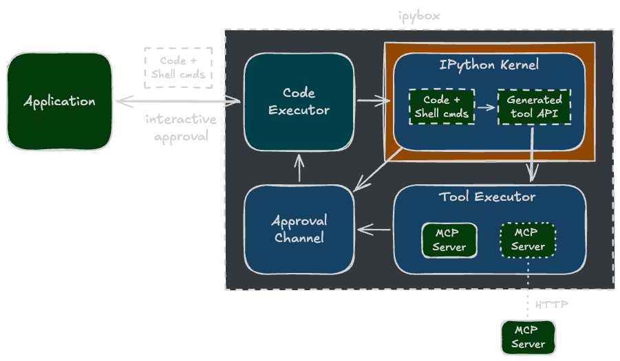

# Architecture

`CodeExecutor` coordinates three components: an IPython kernel for stateful execution of Python code and shell commands, a tool server for MCP tool dispatch, and an approval channel for application-level approval of tool calls and shell commands.

The application submits code to `CodeExecutor`, which forwards it to an IPython kernel running inside an optional sandbox. Shell commands use IPython's `!` syntax and mix freely with Python code in a single block. When code calls a [generated](apigen.md) Python tool API function, the request routes to the tool server, which manages local (stdio) MCP servers and connections to remote (HTTP) MCP servers.

Before executing any tool call, the tool server sends an approval request back through `CodeExecutor` to the application, blocking until it accepts or rejects. Shell commands go through the same approval channel when shell command approval is enabled. MCP tool execution runs outside the kernel sandbox in the tool server. Shell commands execute as kernel subprocesses inside the sandbox when enabled.

!!! info "mcpygen"

    The code generation and tool execution infrastructure is provided by [mcpygen](https://gradion-ai.github.io/mcpygen/) and re-exported by ipybox.

<figure markdown>
  { width="100%" }
  <figcaption><code>CodeExecutor</code> coordinates sandboxed execution of Python code and shell commands, MCP tool execution, and approval of tool calls and shell commands.</figcaption>
</figure>
