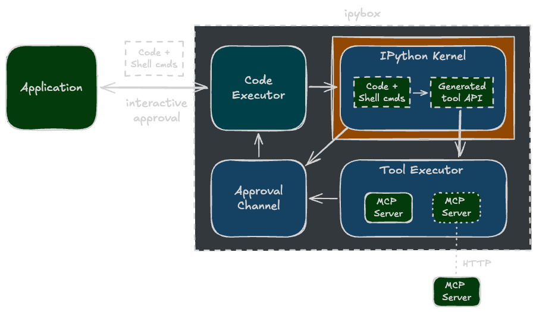

# ipybox

ipybox is a Python code execution sandbox with first-class support for programmatic MCP tool calling. It generates typed Python tool APIs from MCP server tool schemas, supporting both local stdio and remote HTTP servers. 

Code that calls the generated API executes in a sandboxed IPython kernel. The API delegates MCP tool execution to a separate environment that enforces tool call approval, requiring applications to accept or reject each tool call.

<figure markdown>
  { width="100%" }
  <figcaption><code>CodeExecutor</code> coordinates sandboxed code execution, tool execution, and tool call approval.</figcaption>
</figure>

## Agent integration

ipybox is designed for agents that act by executing Python code rather than issuing JSON tool calls. This [code action](https://arxiv.org/abs/2402.01030) approach enables tool composition and intermediate result processing in a single inference pass, keeping intermediate results out of the agent's context window. 

Code actions are also key for agents to improve themselves and their tool libraries by capturing successful experience as executable knowledge. Agent-generated code cannot be trusted and requires sandboxed execution with application-level approval for every MCP tool call.

!!! tip "freeact"

    [Freeact](https://gradion-ai.github.io/freeact/) is an agent harness and CLI tool built on ipybox.
    
## Capabilities

| Capability | Description |
| --- | --- |
| **Stateful code execution** | State persists across executions in IPython kernels |
| **Lightweight sandboxing** | Kernel isolation via Anthropic's [sandbox-runtime](https://github.com/anthropic-experimental/sandbox-runtime) |
| **Programmatic MCP tool calling** | MCP tools called via Python code, not JSON directly |
| **MCP tool call approval** | Every MCP tool call requires application-level approval |
| **Python tool API generation** | Functions and models generated from MCP tool schemas |
| **Any MCP server** | Supports stdio, Streamable HTTP, and SSE transports |
| **Any Python package** | Install and use any Python package in IPython kernels |
| **Local code execution** | No cloud dependencies, everything runs on your machine |

## Usage

| Component | Description |
| --- | --- |
| **[Python SDK](api/code_executor.md)** | Python API for building applications on ipybox |
| **[MCP server](mcpserver.md)** | ipybox as MCP server for code actions and programmatic tool calling |
| **[Claude Code plugin](ccplugin.md)** | Plugin that bundles the ipybox MCP server and a code action skill |
